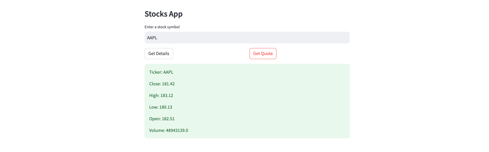

# streamlit-polygon
This is a simple [Streamlit](https://streamlit.io/) web app that fetches and displays **real-time and historical stock data** using the [Polygon API](https://polygon.io/).

### ✨ Features
- Fetch detailed stock ticker information (company name, market cap, employees, website, etc.)
- Plot interactive 30-day historical price charts
- Display previous day's open, close, high, low, volume, and VWAP
- Show key financial metrics (assets, liabilities, revenues, EPS, etc.)
- Responsive design with data tables and interactive charts




### ⏩ Quick Start
1. Clone this repo.
```bash
   git clone https://github.com/alphasecio/streamlit-polygon.git
   cd streamlit-polygon
```
2. Install dependencies.
```bash
   pip install -r requirements.txt
```
3. Run the app.
```bash
   streamlit run streamlit_app.py
```
4. Get a free [Polygon API key](https://polygon.io/dashboard/keys) and input it in the sidebar along with a stock ticker (e.g., AAPL).


### 🚀 Deploying to Railway
For a step-by-step guide to deploying on Streamlit, see [this](https://alphasec.io/build-an-interactive-python-web-app-with-streamlit/) post. To deploy on [Railway](https://railway.app/?referralCode=alphasec), click the button below.

[](https://railway.app/new/template/3D37W6?referralCode=alphasec)
